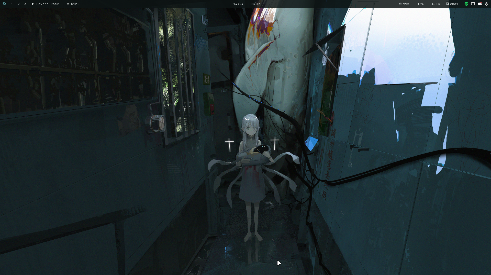
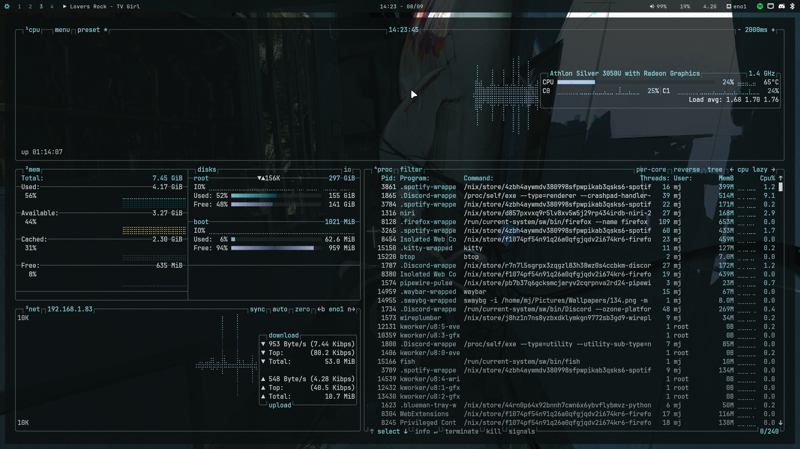
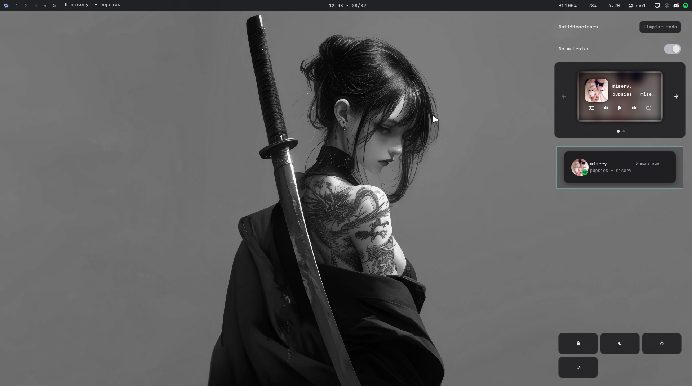

# dotfiles-nixos

My personal dotfiles for **NixOS**. This repository is **open source**: feel free to use, copy, modify, and adapt it to your own setup. If something here helps you, take it.

> ⚠️ This is my personal environment, built to my own taste and needs. It's not meant to be a plug-and-play "framework", but it's organized to be easy to read, understand, and adapt.

## 📸 Preview

<p align="center">
  
  
  
</p>

## ✨ About this setup

- **Operating System:** NixOS
- **Wayland compositors:** [Niri](https://github.com/YaLTeR/niri) and [Hyprland](https://hyprland.org/), both available and selectable from SDDM
- **Theme generation:** [matugen](https://github.com/InioX/matugen), with per-app templates
- **Aesthetic:** monochromatic/gray base, with dynamic accents generated by matugen based on the wallpaper
- **Font:** JetBrainsMono Nerd Font
- **Icons:** Papirus-Dark

## 📁 Repository structure

```
.
├── assets/          # Screenshots used in this README
├── cava/            # Cava audio visualizer configuration
├── fastfetch/       # Fastfetch configuration (system info on terminal start)
├── fuzzel/          # Fuzzel application launcher configuration
├── hypr/            # Hyprland configuration (hyprland.conf, hyprpaper, scripts, colors)
├── hypr-scripts/    # Helper scripts used by Hyprland (shortcuts, utilities, etc.)
├── kitty/           # Kitty terminal emulator configuration
├── matugen/         # Templates and configuration for dynamic color generation
├── niri/            # Niri compositor configuration (config.kdl)
├── nixos/           # System configuration: configuration.nix, hardware-configuration.nix, modules, starship.toml
├── swaync/          # SwayNC notification center configuration
└── waybar/          # Waybar bar configuration (config.jsonc, style.css)
```

Each folder corresponds to a specific tool and contains only that tool's configuration files, so it's easy to find what to edit.

## 🔧 Component breakdown

### `nixos/`
Contains the base system configuration:
- `configuration.nix`: main system definition (packages, services, users, etc.)
- `hardware-configuration.nix`: hardware-specific configuration, auto-generated by the NixOS installer
- Additional modules to organize the system configuration
- `starship.toml`: configuration for the [Starship](https://starship.rs/) terminal prompt

### `niri/`
[Niri](https://github.com/YaLTeR/niri) compositor configuration in `config.kdl` (keybindings, window rules, appearance, animations, etc.).

### `hypr/` and `hypr-scripts/`
[Hyprland](https://hyprland.org/) configuration as an alternative compositor:
- `hypr/`: main config file, wallpaper (hyprpaper), color scheme, and variables
- `hypr-scripts/`: helper scripts (wallpaper switching, various utilities, integrations)

### `waybar/`
Status bar for Wayland. `config.jsonc` defines the displayed modules (clock, battery, network, etc.) and `style.css` the visual style.

### `fuzzel/`
A *dmenu/rofi*-style application launcher for Wayland, used to quickly open programs.

### `kitty/`
Terminal emulator. Includes colors, opacity, cursor, and font configuration.

### `fastfetch/`
Tool for displaying system information (neofetch-style) when opening a new terminal.

### `cava/`
Terminal audio visualizer, styled to visually match the rest of the rice.

### `swaync/`
Notification center for Wayland, styled to match the overall palette.

### `matugen/`
Dynamic color palette generation engine (Material You based). Contains the templates matugen uses to automatically inject colors into Waybar, Kitty, GTK, Hyprland, Cava, wlogout, and more, based on the active wallpaper.

## 🚀 How to use this repository

These dotfiles are built for NixOS and assume a certain system structure. If you want to explore or adapt them:

1. Clone the repository:
   ```bash
   git clone https://github.com/Itzsnow322/dotfiles-nixos.git
   cd dotfiles-nixos
   ```
2. Go through each folder and adapt the paths/packages to your own NixOS configuration.
3. Copy or symlink whichever files you're interested in to your corresponding `~/.config/`.

> Don't version any sensitive data (passwords, tokens, private keys) if you're maintaining your own copy.

## 📜 License

This project is open source. Feel free to use, modify, and share any part of this configuration.

## 🙌 Credits

Partly inspired by the dotfiles structure of [killiam-txt](https://github.com/killiam-txt/dotfiles).

---

If you have questions, suggestions, or find something broken, open an issue or a pull request.